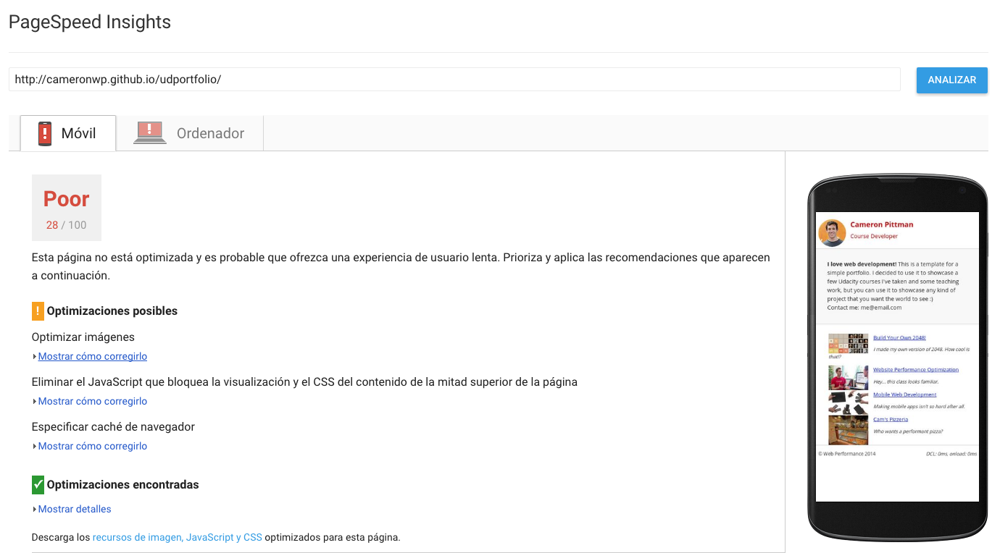
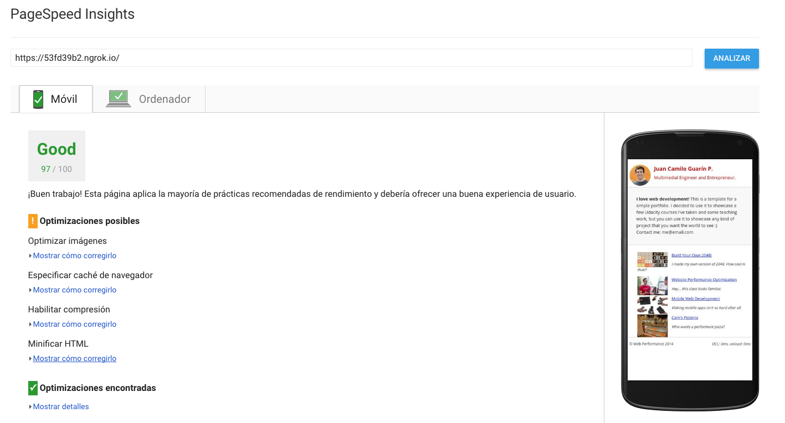
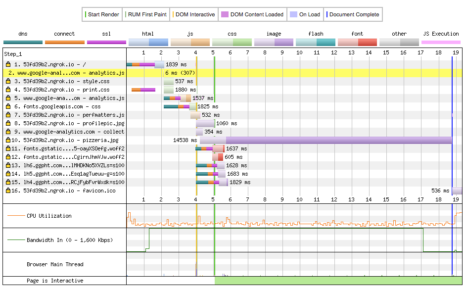
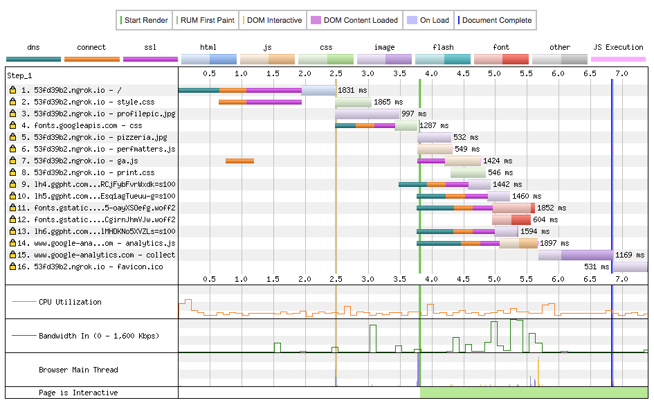

# List of optimizations made

1. Changed print.css to be used only on print view (media="print")
1. Changed Google Analytics to async
1. Created ga.js file to handle the Google Analytics code that was on the index. Then requested it as async.
1. Passed async files to the bottom
1. Optimize pizzeria image to reduce file size. Image was scaled to 150px, going from >2MB to 8kb

## PageSpeed Insights

Before:

After:

## Tests with Webpagetest.org

Waterfall - Before: 

Waterfall - After: 

